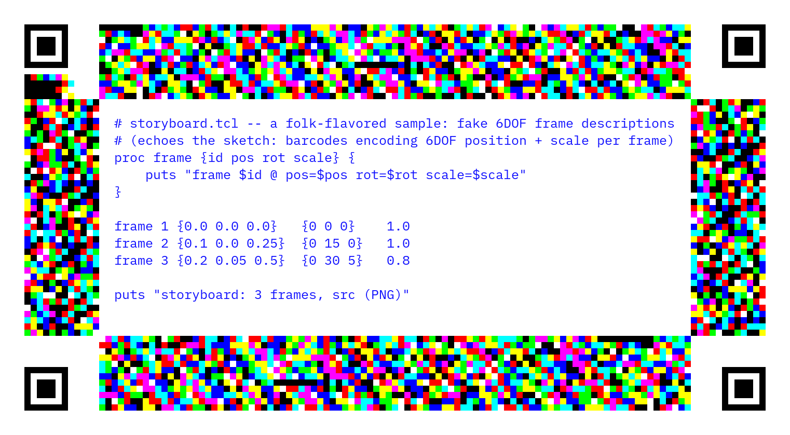

# PrintablePrograms.png

Programs you can print out, pin up, photograph, and run again.

PrintablePrograms.png is a Tcl compiler/AST toolkit for **printable,
physically recoverable programs**: every program can travel as a `.tcl`
file, a canonical XML document, a PNG/JPEG whose pixels *are* the
program, or a printed page whose color border carries the program in a
form that survives a color inkjet printer and a camera.

## Gallery (all live in [`samples/`](samples/))

| artifact | what it is |
|---|---|
| [`storyboard.printout.png`](samples/storyboard.printout.png) | a **printout page**: minimal color-cell page frame + code at 12pt IBM Plex Mono in `#1010FF` on white |
| [`storyboard.printout.rescan.jpg`](samples/storyboard.printout.rescan.jpg) | that page after a simulated rescan (80% rescale + JPEG q82) — still decodes **byte-exact** from pixels alone |
| [`hello.printout.png`](samples/hello.printout.png) | printout page for [`hello.tcl`](samples/hello.tcl) |
| [`hello.png`](samples/hello.png) / [`hello.jpg`](samples/hello.jpg) | pressed images: code panel + the full canonical XML riding in PNG `tEXt` / JPEG `COM` metadata |
| [`storyboard.png`](samples/storyboard.png) / [`storyboard.jpg`](samples/storyboard.jpg) | same, for [`storyboard.tcl`](samples/storyboard.tcl) |
| [`hello.xml`](samples/hello.xml) | the canonical `<tclprogram>` document: byte-exact base64 source + `<commands>` + real `<ast>` |



The page above, screenshotted or printed and photographed (axis-aligned),
decodes back to the byte-exact program — try it:

```sh
tclsh bin/printout.tcl decode samples/storyboard.printout.rescan.jpg
```

## The tools

| tool | job |
|---|---|
| [`bin/press.tcl`](bin/press.tcl) | the **format press**: any-to-any among `.tcl` / `.xml` / `.png` / `.jpg` / `.jpeg`, byte-exact both ways |
| [`bin/printout.tcl`](bin/printout.tcl) | **make and scan printouts**: `encode program.tcl page.png` / `decode photo.jpg` |
| [`lib/tclxml.tcl`](lib/tclxml.tcl) | Tcl ↔ canonical XML hub documents |
| [`lib/tclast.tcl`](lib/tclast.tcl) | real Tcl AST: typed words, nested scripts, semantically-verified source regeneration |
| [`lib/pageframe.tcl`](lib/pageframe.tcl) | the print-survivable **page frame** codec (encoder + screenshot/scan decoder) |
| [`lib/typeset.tcl`](lib/typeset.tcl) | code typesetting: vendored IBM Plex Mono, ≥12pt physical, `#1010FF` on white |
| [`lib/pngcodec.tcl`](lib/pngcodec.tcl) | pure-Tcl PNG chunk surgery (`tEXt` payload channel) |
| [`lib/jpgcodec.tcl`](lib/jpgcodec.tcl) | pure-Tcl JPEG `COM`-segment surgery (survives lossy raster) |

## The press: digital round trips

```
.tcl  <->  .xml  <->  .png  <->  .jpg / .jpeg
```

```sh
tclsh bin/press.tcl samples/hello.tcl hello.xml
tclsh bin/press.tcl hello.xml hello.png
tclsh bin/press.tcl hello.png recovered.tcl      # byte-exact
tclsh bin/press.tcl samples/hello.tcl hello.jpg  # any pair works
```

XML is the canonical hub: a `<tclprogram>` document with the byte-exact
source (base64), a per-command breakdown, and a structural `<ast>`.
Images carry that document in metadata (PNG `tEXt`, JPEG `COM`), so even
`tcl → jpg → tcl` through a lossy codec is byte-exact.

## The printout: physical round trips

```sh
tclsh bin/printout.tcl encode samples/storyboard.tcl page.png
# print it / screenshot it / photograph it (axis-aligned), then:
tclsh bin/printout.tcl decode whatever-came-back.jpg
```

The frame is **minimal by default**: the page grows just enough to hold
the text panel at its physical size, and the band stays as thin as the
format allows (12 cells), widening the perimeter — or, past that,
deepening up to `-maxbandmm` (default 60) — only when the packet needs
it. Fixed geometry is available via `-pagewmm/-pagehmm/-bandmm`.
The band is a ring of large color cells inside a white quiet margin
(printing comfort only — CV doesn't need it):

- **8-color palette** at the RGB cube corners, 3 bits/cell — maximum
  separation for inkjet inks; a **calibration strip** (all 8 colors in
  a known order) lets the decoder re-learn the palette per print.
- **QR-style finder fiducials** in all four corners give the cell pitch;
  the band thickness and exact grid dimensions are **self-encoded** next
  to the calibration strip, so cell-count recovery is immune to pitch
  measurement error at any scale.
- **Header**: hostname, IP, program id, filename
  (`YYYYMMDD-HHMMSS-mmmZ.folk.png`, UTC), page + cell size in mm — the
  page **encodes its own physical scale** (`scale_px_per_mm` is
  reported on decode), created timestamp, and origin URL.
- **Payload**: as much of the program as fits. The whole packet is
  CRC32-guarded and repeated to fill the band; the decoder takes the
  first copy that checks out. If the program is too long
  (`complete=0`), the printed prefix + the human-readable text carry
  most of it, and the full source can be pulled from
  `http://<ip>/folk-data/program/<filename>`.
- The code panel is set in the **vendored IBM Plex Mono**
  ([`fonts/`](fonts/), OFL-licensed) at a **minimum of 12pt physical**
  regardless of frame size (never scaled down), in **`#1010FF` on
  white** for maximum non-black contrast. A `tEXt` chunk still carries
  the full canonical XML as a lossless digital channel.

Decoder assumptions: axis-aligned raster (screenshot, or a deskewed
scan); arbitrary uniform or anisotropic scaling, mild blur, and JPEG
recompression are handled (see [`tests/pageframe.tcl`](tests/pageframe.tcl)).
Perspective / rotation rectification is the CV layer's job (future
work, cf. [`../smokesignal`](../smokesignal)).

## Tests

```sh
tclsh tests/press.tcl       # 12 checks: all format-pair roundtrips, byte-exact
tclsh tests/pageframe.tcl   # 22 checks: AST + page frame, incl. simulated
                            # screenshot (up/downscale) and rescan (blur+JPEG)
```

## Layout

```
bin/press.tcl       the format press (extension-driven CLI)
bin/printout.tcl    printout page encoder / screenshot+scan decoder
lib/tclxml.tcl      Tcl <-> canonical XML
lib/tclast.tcl      real Tcl AST: parse, XML emission, source regeneration
lib/pngcodec.tcl    pure-Tcl PNG chunk read/write + tEXt embed/extract
lib/jpgcodec.tcl    pure-Tcl JPEG COM-segment embed/extract
lib/typeset.tcl     code typesetting (ImageMagick + vendored IBM Plex Mono)
lib/pageframe.tcl   pixel-domain page frame: encoder + screenshot/scan decoder
fonts/              vendored IBM Plex Mono (OFL)
docs/SPEC.mermaid   full ecosystem tech spec (built + planned phases)
samples/            sample .tcl programs + the gallery artifacts above
tests/              test suites
```

## Requirements

- Tcl 8.6+ (uses built-in `zlib`)
- ImageMagick (`convert`/`magick`) for typesetting, PNG↔JPEG raster
  transcodes, and printout decoding; the metadata payload channels work
  without it.

## Roadmap (from the sketch — see [docs/SPEC.mermaid](docs/SPEC.mermaid))

- `.folk.png` with RGB burn-blend barcodes encoding 6DOF position + scale
  (see [`../smokesignal`](../smokesignal) for prior art)
- `.png.folk` — base64 PNG packed into a folk program
- Paper-size render targets: `.folk.A3/A4/A5/A6/A7.png`, usletter, 80x40mm
- `.tcl.folk`, `.tk.folk`, `.c.folk`, `.folk.rs`, `.folk.go`
- Document targets: PDF, HTML, Keynote, PPTX, hypercard(???)
