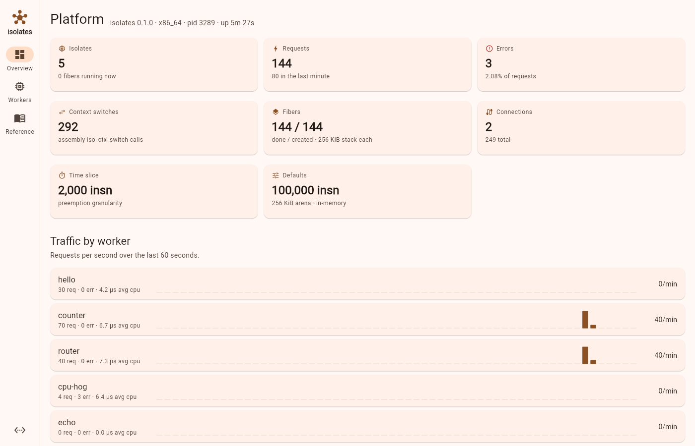
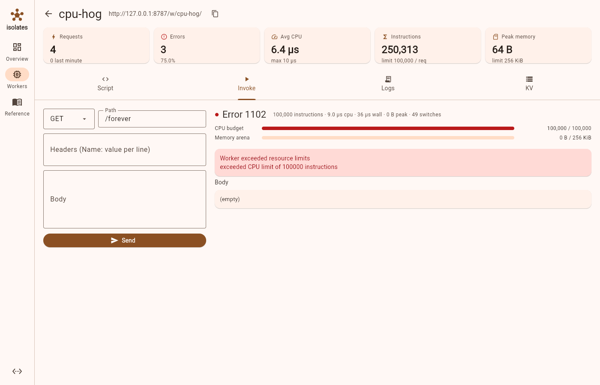

# isolates

A small clone of the Cloudflare Workers "isolates" platform: one process hosts
many tenants' code, every request runs in its own sandboxed isolate with hard
CPU and memory limits, and a control plane deploys, routes and observes the
workers. The runtime is C built with GNU make, the context switching is
hand-written assembly, and the dashboard is a Flutter app.

```
isolates/
├── Makefile                 GNU make build, tests, run and bench targets
├── runtime/
│   ├── include/isolates.h   shared types and the public runtime API
│   └── src/
│       ├── context_x86_64.S fiber context switch (System V x86-64)
│       ├── context_aarch64.S fiber context switch (AAPCS64)
│       ├── context.c        lays out a fresh fiber stack for the switch
│       ├── arena.c          per-request bump allocator (mmap)
│       ├── vm.c             isoasm assembler + bytecode interpreter
│       ├── isolate.c        isolates, fibers, scheduler, persistence
│       ├── kv.c             per-worker KV namespace
│       ├── http.c           HTTP/1.1 server, routing, JSON control API
│       ├── util.c           clocks, buffers, JSON reader/writer
│       └── main.c           CLI: serve / run / asm / bench / reference
├── workers/                 sample workers (*.isoasm)
├── tests/                   unit tests and an HTTP smoke test
└── dashboard/               Flutter control-plane UI
```

## How it maps to the real thing

| Cloudflare Workers                          | isolates                                                      |
|---------------------------------------------|---------------------------------------------------------------|
| V8 isolate per tenant, shared process       | `iso_isolate` per worker, single process, single thread       |
| JavaScript worker script                    | `isoasm` stack-machine script, assembled to bytecode          |
| Per-request isolate context                 | `iso_fiber`: private machine stack + private memory arena     |
| CPU time limit (error 1102)                 | instruction budget per request, error 1102                    |
| Memory limit (error 1102)                   | arena size per request, error 1102                            |
| Uncaught exception (error 1101)             | VM trap: bad types, stack underflow, division by zero, ...    |
| `*.workers.dev` / route matching            | `/w/<name>/...` path prefix or `Host: <name>.<anything>`      |
| Workers KV                                  | in-memory KV namespace per worker, browsable via the API      |
| Environment bindings                        | `env` instruction, set at deploy time                         |
| `wrangler deploy`                           | `PUT /api/workers/<name>` with the script, limits and env     |
| Dashboard                                   | the Flutter app in `dashboard/`                               |

The interesting part is the scheduler. Each request becomes a fiber with its
own 256 KiB stack (plus a guard page). `iso_ctx_switch` in the `.S` files saves
the callee-saved registers, swaps stack pointers and returns on the other
stack; `iso_ctx_init` fakes the first frame so that the first switch lands in
`iso_ctx_trampoline`, which calls the fiber's entry function. The interpreter
runs 2,000 instructions per slice and then switches back to the scheduler, so
a worker stuck in a loop cannot starve the others, and when its budget runs
out the request fails with error 1102 while everything else keeps running.

## Build and run

Requires a C11 compiler, GNU make and Linux on x86_64 or aarch64.

```sh
make            # bin/isolates
make test       # unit tests + HTTP smoke test (needs curl)
make run        # serve sample workers on http://127.0.0.1:8787
make bench      # throughput of workers/counter.isoasm
```

Then:

```sh
curl http://127.0.0.1:8787/w/hello/anything
curl http://127.0.0.1:8787/w/counter
curl -H 'Host: echo.workers.local' 'http://127.0.0.1:8787/?a=1'
curl -i http://127.0.0.1:8787/w/cpu-hog/forever      # 503, Error 1102
curl http://127.0.0.1:8787/api/status
```

Deploy from the command line:

```sh
curl -X PUT http://127.0.0.1:8787/api/workers/greeter \
  -H 'content-type: application/json' \
  -d '{"script":"push \"hi\\n\"\nres.body\nhalt","cpu_limit":20000,"env":{"NAME":"x"}}'
```

Persist deployments across restarts with `bin/isolates serve --data ./data`.

Run a script once without the server:

```sh
bin/isolates run workers/router.isoasm --path /api/shout --method POST --body hello -v
bin/isolates asm workers/counter.isoasm
bin/isolates reference
```

## Writing a worker

One instruction per line, labels end in `:`, comments start with `;` or `#`.
The VM is a stack machine with 64-bit integers and immutable strings, 64 local
slots and a call stack. The request is exposed through `req.*` host calls, the
response is built with `res.*`, and `halt` sends it.

```asm
; count visits per path
req.path
dup
kv.get
atoi
push 1
add
dup
store 0            ; local 0 = new count
kv.put             ; key value -> store  (key was left by dup)

push "content-type"
push "text/plain"
res.header
req.path
push " visited "
concat
load 0
concat
push " times\n"
concat
res.body
halt
```

`bin/isolates reference` (or the Reference tab of the dashboard) lists every
instruction. Runtime faults are reported as error 1101 with the failing
program counter; exhausting the CPU or memory budget is error 1102.

## Control API

| Method | Path                               | Purpose                                   |
|--------|------------------------------------|-------------------------------------------|
| GET    | `/api/status`                      | platform and scheduler counters           |
| GET    | `/api/workers`                     | list workers with metrics and rps history |
| PUT    | `/api/workers/{name}`              | deploy `{script, cpu_limit?, mem_limit?, env?}` |
| GET    | `/api/workers/{name}`              | details including source and bindings     |
| DELETE | `/api/workers/{name}`              | remove the worker                         |
| POST   | `/api/workers/{name}/invoke`       | run `{method, path, headers, body}`, get response + metrics |
| GET    | `/api/workers/{name}/logs`         | log ring buffer (`DELETE` clears)         |
| GET    | `/api/workers/{name}/disasm`       | bytecode listing                          |
| GET    | `/api/workers/{name}/kv`           | KV entries; `PUT/GET/DELETE .../kv/{key}` |
| POST   | `/api/assemble`                    | syntax-check a script without deploying   |
| GET    | `/api/examples`                    | bundled sample scripts                    |
| GET    | `/api/reference`                   | instruction set documentation             |

All responses carry `Access-Control-Allow-Origin: *` so the dashboard can be
served from anywhere during development.

## Dashboard





```sh
cd dashboard
flutter pub get
flutter run -d chrome                            # against http://127.0.0.1:8787
cd .. && make dashboard                          # same-origin web build, then
make run                                         # serves it at http://127.0.0.1:8787/
```

`make run` serves the built dashboard at `http://127.0.0.1:8787/` when it
exists; otherwise the root path prints a short usage note.

## Limits and non-goals

- Single threaded by design (like one Workers runtime process per core);
  scale out by running more processes.
- HTTP/1.1 only, no keep-alive, no TLS: put it behind a real proxy.
- The scheduler is cooperative at instruction granularity; a host call cannot
  block, so there is nothing to preempt inside one.
- Only Linux x86_64 and aarch64 have a context switch implementation.
