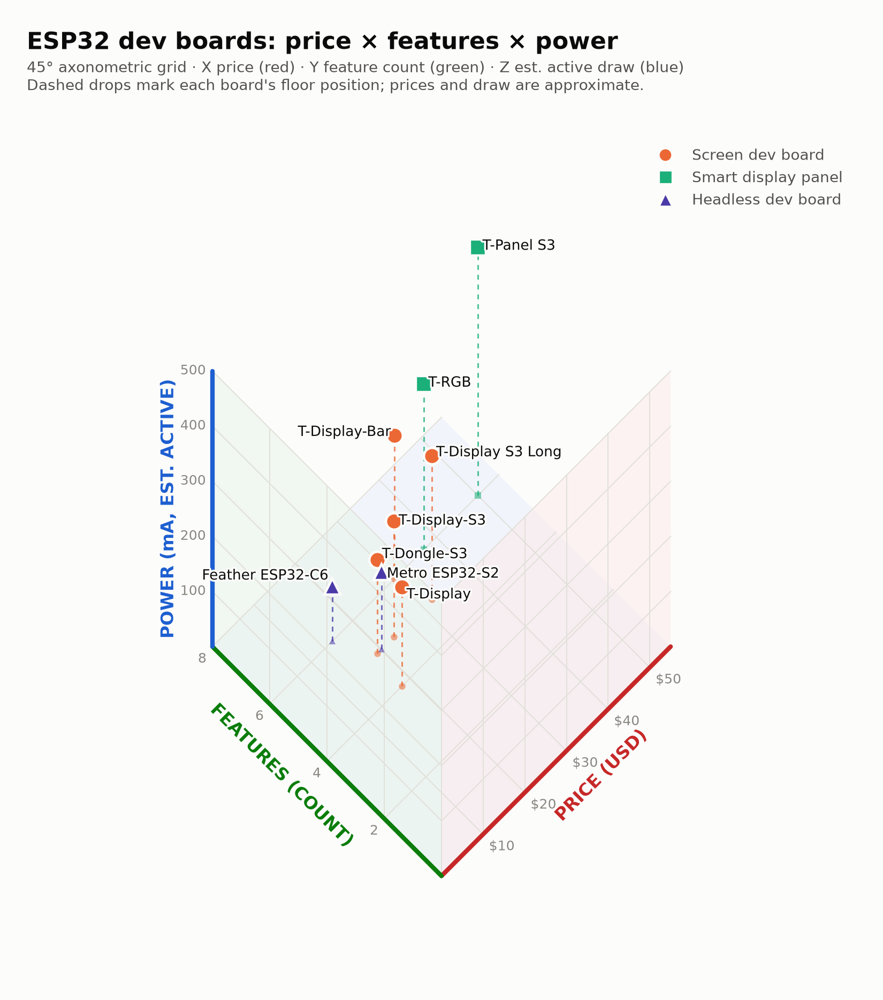

# Isometric device chart

A 3-axis Cartesian chart on a 45° axonometric ("military") perspective grid,
drawn with Matplotlib in plain 2D — the projection is hand-rolled so the ground
axes sit at exactly ±45° and all three axes read at full, equal length.

Axes use the classic R/G/B convention:

- **X (red)** — price, USD
- **Y (green)** — feature count
- **Z (blue)** — power needs, estimated typical active draw (mA, WiFi on,
  backlight on where present)

Dots are color- and shape-coded by kind of device; the dashed drop line ties
each point to its position in the price × features ground plane.

```sh
python3 chart.py   # writes esp32-isometric-light.png and esp32-isometric-dark.png
```



## Data

Street prices and current draw are approximate (August 2026); feature count is
the length of the feature list.

| Device | Kind | Price (USD) | Features (count) | Est. active draw (mA) |
|---|---|---:|---:|---:|
| LILYGO T-Display | Screen dev board | 18 | 1.14″ LCD, WiFi, BT, LiPo charge (4) | 180 |
| LILYGO T-Display-S3 | Screen dev board | 23 | 1.9″ LCD, touch, WiFi, BLE 5, LiPo charge (5) | 210 |
| LILYGO T-Display S3 Long | Screen dev board | 32 | 3.4″ LCD, touch, WiFi, BLE 5, LiPo charge (5) | 260 |
| LILYGO T-Display-Bar | Screen dev board | 30 | 2.25″ LCD, touch, WiFi, BT, TF slot, LiPo charge (6) | 260 |
| LILYGO T-Dongle-S3 | Screen dev board | 19 | 0.96″ LCD, WiFi, BT, TF slot, RGB LED (5) | 170 |
| LILYGO T-RGB | Smart display panel | 37 | 2.1″ round IPS, touch, WiFi, BT, TF slot, LiPo charge (6) | 300 |
| LILYGO T-Panel S3 | Smart display panel | 50 | 3.95″ IPS, touch, WiFi, BT, TF slot, RS-485 (6) | 450 |
| Adafruit Feather ESP32-C6 | Headless dev board | 15 | WiFi 6, BLE 5, Zigbee/Thread, LiPo charge, STEMMA QT, NeoPixel (6) | 100 |
| Adafruit Metro ESP32-S2 | Headless dev board | 20 | WiFi, 30+ GPIO, STEMMA QT, LiPo charge, NeoPixel (5) | 140 |

Edit the `DEVICES` list in `chart.py` to add boards or correct numbers — the
feature count and both renders update from it.
