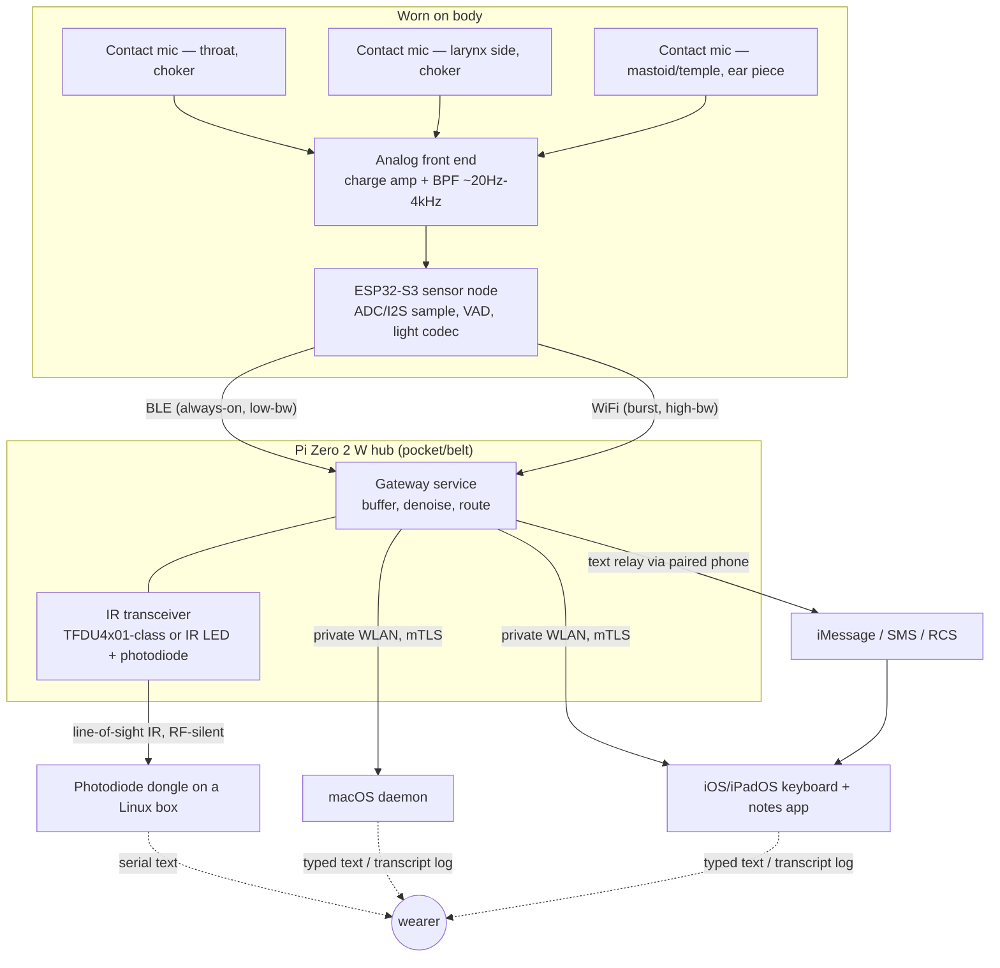

# Architecture

## System diagram

## Two sensor nodes, one protocol

Both the choker and the ear piece are the same firmware/hardware pattern —
1-3 contact mic channels into an ESP32-S3 that timestamps and streams
frames. They can run simultaneously (choker for throat/larynx, ear piece
for mastoid) and get mixed/selected at the hub, or the ear piece can be
the sole node for a lower-profile prototype. Keep them on the same wire
protocol from day one so the hub doesn't care how many nodes are present.

## Data flow

1. **Sense**: contact mic → charge amp → bandpass filter (~20 Hz–4 kHz,
   matched to what tissue/bone actually passes — well below normal 8 kHz
   speech bandwidth) → ADC.
2. **Node-local**: simple energy-based VAD gates transmission (don't
   stream silence), then either raw PCM (prototype phase) or a light
   codec (ADPCM, later Opus) to cut bandwidth before radio.
3. **Node → hub**: BLE GATT notify for the always-on low-rate link
   (control/VAD-gated speech), WiFi (ESP-NOW or a UDP socket to the hub's
   AP) when higher-fidelity streaming is worth the extra power draw.
4. **Hub**: reassembles frames, runs enhancement tuned to the contact-mic
   transfer function (this is not off-the-shelf RNNoise, which assumes an
   air-mic + room-noise model — see `risks.md`), then either runs ASR
   locally (whisper.cpp tiny/base, fine-tuned) or forwards audio to the
   phone/Mac for on-device transcription.
5. **Hub → Apple device(s)**: routing picks the best available transport
   (below).
6. **Apple-side app**: text goes into the focused text field (keyboard
   extension) or a running transcript log (notes-loop daemon/app); audio
   is kept alongside the transcript for correction/playback.

## The four transport modes

| mode | bandwidth | latency | when to use it | how it actually works |
|---|---|---|---|---|
| **Private WLAN (mTLS)** | high | low | primary path, hub and phone/Mac share a network | Pi runs its own closed AP (hostapd, WPA3-SAE, falls back to WPA2-PSK for older clients) or joins the home/venue WiFi. App layer is a small WebSocket/TCP service on the Pi with a self-signed cert pinned by the iOS/macOS client — mutual auth, no cloud in the loop. |
| **iMessage / SMS** | text only (~few hundred chars/segment) | store-and-forward | no shared data link, need a short utterance delivered anywhere | Neither iMessage nor carrier SMS has a public "send as" API. The realistic path is: Pi/ESP32 pushes transcript text to the *paired* iPhone over BLE/WLAN, and a Shortcuts automation (triggered by a local notification/NFC/Focus change) sends it as iMessage/SMS from the phone's own Messages app. An independent path (hub sends SMS without a nearby phone) needs its own cellular modem + SIM + an aggregator API like Twilio — treat as a stretch goal, not phase 1. |
| **RCS ("new MMS")** | medium (compressed audio clips, images) | store-and-forward | same as SMS but you want to attach a short audio clip, not just text | Google's RCS (GSMA Universal Profile) and Apple's iOS 18+ RCS support are both carrier/OS-brokered, not something a Pi can originate directly. Same relay-through-paired-phone pattern as SMS; treat true device-independent RCS sending as needing an Android-side bridge or a business-messaging API, out of scope for phase 1. |
| **IR laser / optical** | low-medium (serial-rate) | low, line-of-sight only | deliver a transcript to a specific Linux box in the room without emitting RF at all | Not an actual Class 3B laser — use an eye-safe IrDA-class transceiver (e.g. Vishay TFDU4101, SIR up to 115.2 kbps) or a collimated 940 nm IR LED on-off-keyed at UART rates, received by a photodiode + transimpedance amp + comparator feeding a USB-serial adapter on the target box. See `risks.md` for the Class 1/1M eye-safety requirement — this is not a "point a laser pointer at a photodiode" hack. |

WLAN is the workhorse. SMS/RCS/IR exist because the prompt specifically
wants "if there's no WLAN, or if RF itself is unwelcome in this room,
here's how the transcript still gets out" — treat them as fallback/niche
paths, not the primary design target, and don't let them drive the PCB
(they're mostly software/dongle problems on the hub side, see `pcb-plan.md`).
