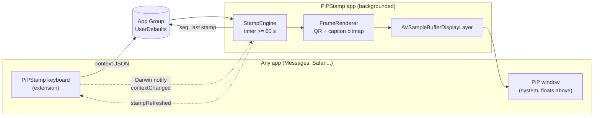

# PiPStamp

An iOS app that keeps a QR code floating over every other app. The code
encodes a small Markdown "stamp": which app you are in, what is on screen
around your cursor, the date and time, and a sequence number. It refreshes on
a timer you set in the app (60 s minimum) and instantly whenever the bundled
keyboard sees something new.

Two iOS features that were never meant for this do the work:

- **Picture in Picture** keeps a video window on top of everything. The
  "video" is a sequence of still frames, one per refresh, rendered from a
  QR code.
- **A custom keyboard** is the only third-party code iOS lets run inside
  another app. It reads the text field it is attached to, tags the host app,
  and shows the same QR code in the keyboard itself for when the PiP window is
  hidden.

> Assumption: "as a MD" in the brief is read as **Markdown**. The payload is
> a heading plus `- key: value` bullets, readable as text and trivially
> parseable.

## How it works



Refresh cycle, in order:

1. The engine composes a `Stamp` from the clock, the latest keyboard context,
   the device name and the settings.
2. `StampFormatter` renders it as Markdown.
3. `QRRenderer` (Core Image `CIQRCodeGenerator`, nearest-neighbour scaled) and
   `FrameRenderer` produce a white bitmap with the code and a one-line caption.
4. `SampleBufferFactory` wraps the bitmap in a `CMSampleBuffer` flagged
   *display immediately*, and `PiPController` enqueues it on the display layer.
   iOS repaints the PiP window from that layer.
5. The next timer is armed. A keyboard capture, a significant time change, or
   the app returning to the foreground all trigger step 1 early and restart the
   countdown.

## The stamp format

```markdown
# PiPStamp #128
- date: 2026-09-13
- time: 14:02:11-07:00
- app: Messages (manual, 4s ago)
- field: keyboard=default return=send doc=1F3A9C0B
- text: "hey are you coming to|"
- device: iPhone
- refresh: 60s
```

| Line | Meaning |
| --- | --- |
| `# PiPStamp #N` | Format marker and monotonically increasing sequence number. |
| `date`, `time` | Local time with UTC offset, so stamps from different zones still order. |
| `app` | Bundle ID when available, otherwise the label the user tapped in the keyboard, otherwise `unknown`. The parenthesis says where it came from and how stale it is. |
| `field` | Keyboard type, return key type and a shortened `documentIdentifier`, which distinguishes text fields within one app. |
| `text` | Text around the cursor. `\|` marks the cursor, `[...]` a selection, `…` a truncation. Quotes and newlines are escaped. |
| `device` | `UIDevice.name` from the app, `UIDevice.model` from the keyboard. |
| `refresh` | Interval the app was set to when the stamp was made. |

Every bullet is `^- (\w+): (.*)$`, so a scanner needs one regular expression.
Optional lines can be switched off in the app to keep the code coarse.

## Two surfaces for one code

| | PiP window | Keyboard panel |
| --- | --- | --- |
| Visible when | Any app, as long as PiP is running and not swiped aside. | Whenever a text field has focus and the PiPStamp keyboard is chosen. |
| Rendered by | The app, in the background. | The keyboard extension, from the field it is attached to. |
| Freshness | Timer plus keyboard pings. | Recomputed on every keystroke, so it can lead the PiP window by a few seconds. |
| Needs | `audio` background mode, active playback audio session. | Nothing extra to show; *Allow Full Access* to talk to the app. |

The keyboard also has an **Insert** key that types the current stamp into the
host field, which turns any text field into a place to leave a timestamped,
context-tagged note.

## What iOS does and does not allow

This design leans on the edges of the platform, so the constraints are the
design:

- **Current app.** No public API tells a keyboard or a background app which
  app is frontmost. The keyboard offers label chips (configurable in the app)
  to tag it by hand, and `documentIdentifier` to tell fields apart. For
  personal builds, `HostApp.swift` can read a private property when the
  `PIPSTAMP_PRIVATE_HOST_ID` flag is set. That would be rejected from the App
  Store, so it is off by default.
- **What is on screen.** Only the text field the keyboard is attached to, via
  `documentContextBeforeInput` and friends, and only the part the host app
  exposes (often one sentence or paragraph). Nothing else on screen is
  readable. Secure fields expose nothing.
- **Keyboard to app.** Extensions and apps share data only through an App
  Group, and a keyboard can use one only with *Allow Full Access* on. Darwin
  notifications carry the "something changed" ping; the payload lives in the
  shared `UserDefaults`.
- **Staying alive in the background.** PiP driven by `AVSampleBufferDisplayLayer`
  keeps the app running while the window is up, and the `audio` background
  mode plus a `.playback` session is required to start it. A looping silent
  file (`SilentAudioKeeper`, on by default) guards against iOS deciding the
  process is idle on long intervals.
- **PiP contents.** The PiP window is sized from the frame's aspect ratio and
  cannot be interacted with beyond play/close. `requiresLinearPlayback` hides
  the skip buttons; the playback delegate reports a live, unbounded stream so
  no scrubber appears.
- **Scannability.** A phone-sized PiP window is roughly 200 pt wide. Keep the
  payload under about 300 bytes at error correction M so the code stays under
  ~70 modules per side. The app shows byte count and module count live.

## Project layout

```
pipstamp/
├── project.yml                 XcodeGen spec (two targets)
├── Shared/                     compiled into both targets
│   ├── Stamp.swift             StampContext, Stamp, StampFormatter (Markdown)
│   ├── StampSettings.swift     settings + clamping (60 s floor)
│   ├── SharedStore.swift       App Group UserDefaults wrapper
│   ├── DarwinNotifier.swift    cross-process pings
│   ├── QRRenderer.swift        CIQRCodeGenerator → crisp CGImage
│   └── FrameRenderer.swift     QR + caption bitmap, CMSampleBuffer factory
├── PiPStamp/                   the app
│   ├── PiPStampApp.swift
│   ├── ContentView.swift       preview, PiP, refresh, payload, keyboard, setup
│   ├── SampleBufferView.swift  hosts the PiP source layer in SwiftUI
│   ├── PiPController.swift     AVPictureInPictureController + delegates
│   ├── StampEngine.swift       timer, composition, refresh reasons
│   ├── SilentAudioKeeper.swift
│   ├── Info.plist              UIBackgroundModes: audio
│   └── PiPStamp.entitlements   App Group
└── PiPStampKeyboard/           the keyboard extension
    ├── KeyboardViewController.swift  stamp bar, chips, QR panel, QWERTY
    ├── HostApp.swift           optional private host-app lookup
    ├── Info.plist              RequestsOpenAccess: YES
    └── PiPStampKeyboard.entitlements
```

## Build and run

Requires Xcode 15 or newer, iOS 16 or newer, and a physical device: PiP and
custom keyboards do not behave fully in the Simulator.

```sh
brew install xcodegen
cd pipstamp
xcodegen generate
open PiPStamp.xcodeproj
```

Then, in Xcode:

1. Set your team on both targets.
2. Change the App Group `group.com.cwervo.pipstamp` in `project.yml`,
   `Shared/SharedStore.swift` and both `.entitlements` files to one registered
   to your team, and pick your own bundle IDs.
3. Run the **PiPStamp** scheme on the device.

On the device:

1. Settings → General → Keyboard → Keyboards → Add New Keyboard → PiPStamp.
2. Tap PiPStamp in that list and turn on **Allow Full Access**.
3. Open PiPStamp, pick a refresh interval, tap **Start PiP** (or just leave
   the app, it starts automatically).
4. In any app, hold the globe key and choose PiPStamp. Tap a label chip or
   just type; the PiP window updates within a second or two.

## Privacy notes

The keyboard reads text around the cursor and writes it to the shared
container. That is the point of the app, but it is also exactly what iOS
warns users about when they enable Full Access. Keep this in mind:

- "Capture while typing" can be turned off; then only the **Capture**,
  **Insert** and label chips write anything.
- Secure text fields (passwords) expose no text to keyboards.
- Everything stays on the device. There is no network code in either target.

## Ideas for later

- Encrypt or sign the payload so a scanner can verify which device made it.
- Add a Shortcuts action so automations can push their own context line.
- Support a "compact" stamp (date, time, seq only) for a smaller, faster-scanning
  code when the text is not needed.
- Render the PiP frame at the exact reported render size for pixel-perfect
  modules.
