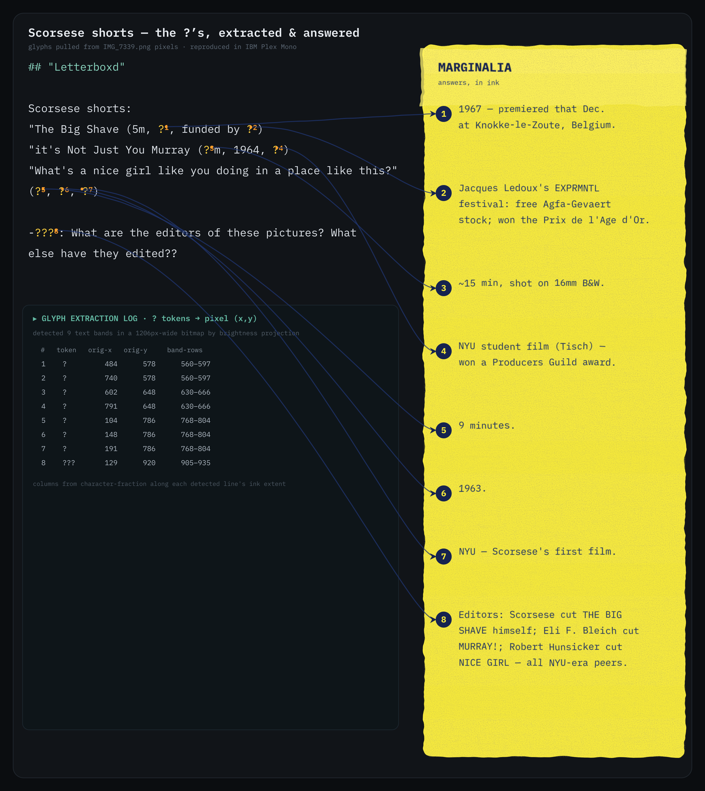

# Scorsese shorts — the `?`s, extracted & answered

A Tcl program that reads a screenshot (`IMG_7339.png`) of a text message about
Martin Scorsese's short films, **extracts the `?` / `???` unknowns straight from
the pixels**, correlates each one with an X/Y position in the original bitmap,
and **reproduces the message** as an annotated composition where every unknown
carries a footnote superscript and an arrow leading to its answer.



## Files

| file | role |
|------|------|
| `png_reader.tcl` | Pure-Tcl PNG decoder — parses IHDR/IDAT, inflates with the built-in `zlib`, and hand-reconstructs the filtered 16-bit RGB scanlines into 8-bit luma. No Tk, no external image libraries. |
| `extract_and_annotate.tcl` | The pipeline: pixel extraction → coordinate correlation → SVG generation → raster. |
| `scorsese_annotated.svg` / `.png` | The generated artwork. |

## How it works

1. **Pixel extraction.** The PNG is decoded to a grayscale luma buffer. A
   per-scanline brightness projection finds the *text bands* (contiguous inky
   rows) of the message, and a per-band horizontal ink extent gives each line's
   left/right edge.
2. **Correlation.** The transcript flags each real unknown (`\x01` for a single
   `?`, `\x02` for the `???`); rhetorical `?`s are left alone. Each unknown is
   snapped to its nearest detected band and placed along that band's ink extent
   by character fraction, yielding an `(x, y)` in the **original bitmap** — see
   the "GLYPH EXTRACTION LOG" panel in the output and the console report.
3. **Reproduction.** The message is re-typeset in **IBM Plex Mono** (Google
   Fonts) with superscript footnote markers `?¹ … ???⁸`, and hand-drawn bezier
   arrows lead to a highlighter-yellow marginalia panel.

## The requested texture, done with SVG filters

* **Rice-paper grain** — `feTurbulence` fractal noise routed to alpha via
  `feColorMatrix` (`#grain` fine speckle + `#mottle` cloudy pulp + `#fibre`
  anisotropic long fibres).
* **Highlighter edges** — `feDisplacementMap` (`#rough`) gives the yellow swipe
  its wavy, hand-drawn border.
* **Ink** — the navy-blue answers use `feTurbulence` → `feDisplacementMap` to
  warp the glyph edges plus `feGaussianBlur` to soften them, so the type bleeds
  like real ink (`#ink`, `#inkHeavy`).

## Run it

```sh
tclsh extract_and_annotate.tcl [path/to/IMG_7339.png]
```

Requires `tclsh` (8.6+, for built-in `zlib`) and `rsvg-convert` for the raster
step. IBM Plex Mono must be installed so the renderer can find the family
(`fc-list | grep -i "plex mono"`).

## The answers

| # | unknown | answer |
|---|---------|--------|
| 1 | *The Big Shave* year | **1967** (premiered Dec 1967, Knokke-le-Zoute, Belgium) |
| 2 | *The Big Shave* funding | Jacques Ledoux's **EXPRMNTL** festival — free Agfa-Gevaert stock; won the **Prix de l'Âge d'Or** |
| 3 | *Murray!* runtime | ~**15 min**, 16mm B&W |
| 4 | *Murray!* production | **NYU** student film (Tisch); won a Producers Guild award |
| 5 | *Nice Girl* runtime | **9 min** |
| 6 | *Nice Girl* year | **1963** |
| 7 | *Nice Girl* production | **NYU** — Scorsese's first film |
| 8 | the editors (`???`) | Scorsese cut *The Big Shave* himself · **Eli F. Bleich** cut *Murray!* · **Robert Hunsicker** cut *Nice Girl* — all NYU-era peers |
