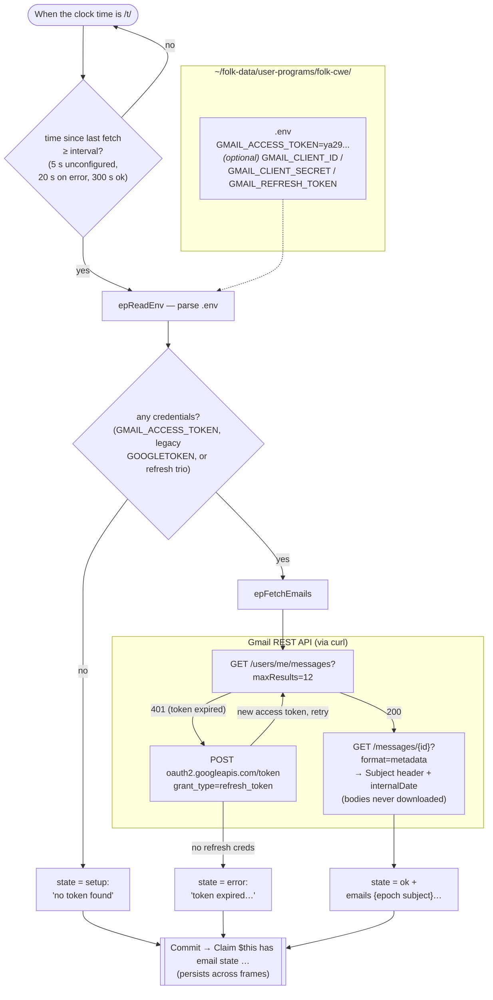
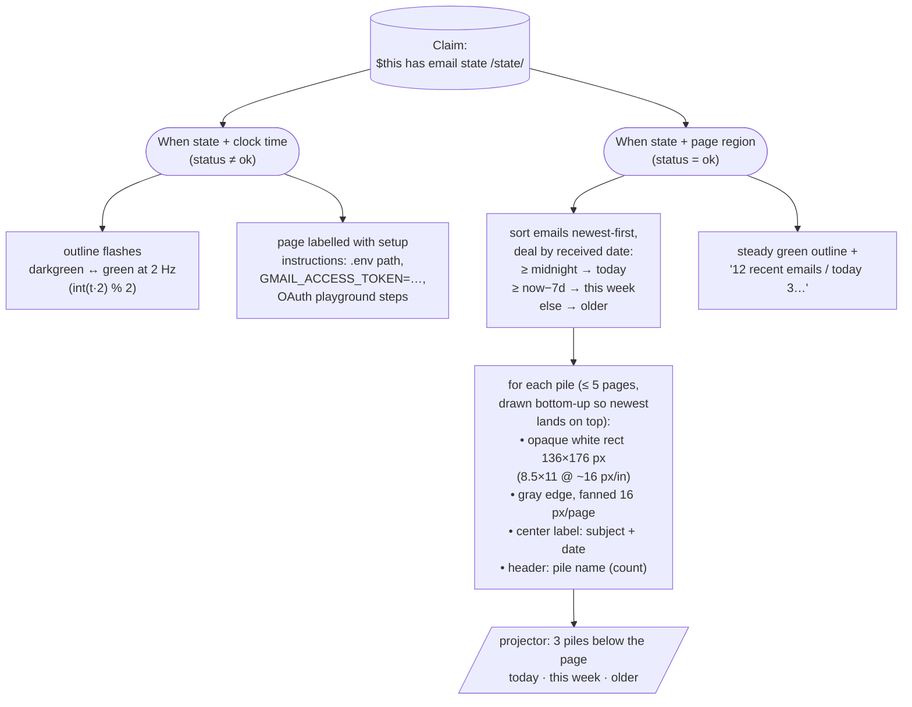
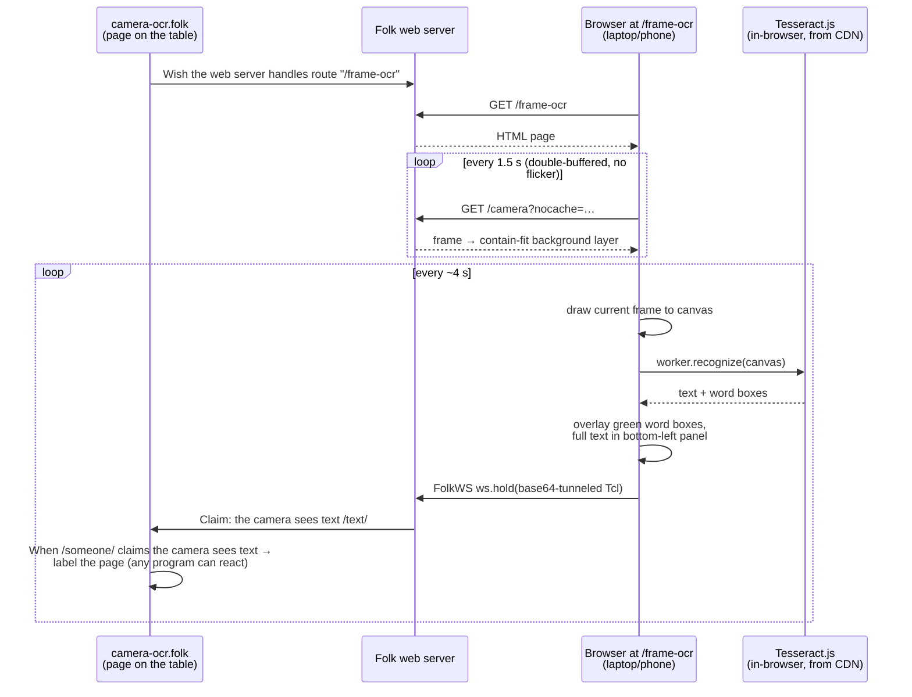
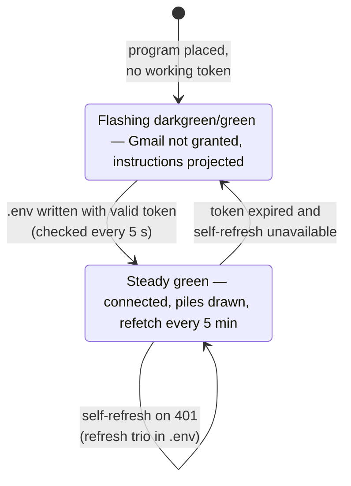

# How the folk-cwe programs work

## email-piles.folk — data flow

## What gets projected — the two `When`s that react to the state

## camera-ocr.folk — slice → HTML, OCR everything in frame

## Outline color = connection status

